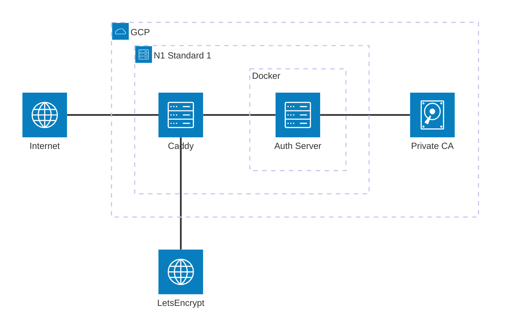

# AnshulG Clusters

A collection of clusters, servers, and configurations for all things me.

# Components

## [`./terraform`](./terraform/)

Terraform deployment for GKE and GCP resources.
Deployed using Terraform Cloud.

Sets up:

- GKE Cluster with node pools
- Auth Server Instance
- Storage Buckets
- Private Certificate Authority
- DNS
    - anshulg.com
    - anshulg.direect
- Load Balancers and CDN

## [`./auth-server`](./auth-server/)

KanIDM Auth Server for managing users and authentication.

Runs on a dedicated `n1-standard-1` running OpenSUSE Leap 15.6.
Deployed using Docker Compose.

Deployed via Github Actions.
The `deploy.sh` script copies the required files to the server
and runs the `setup.sh` script to setup and run the server.

Server Architecture:

